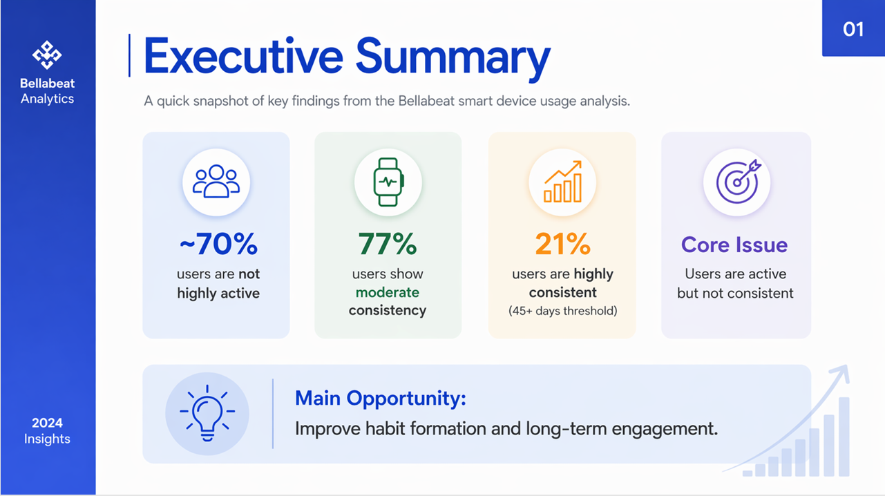
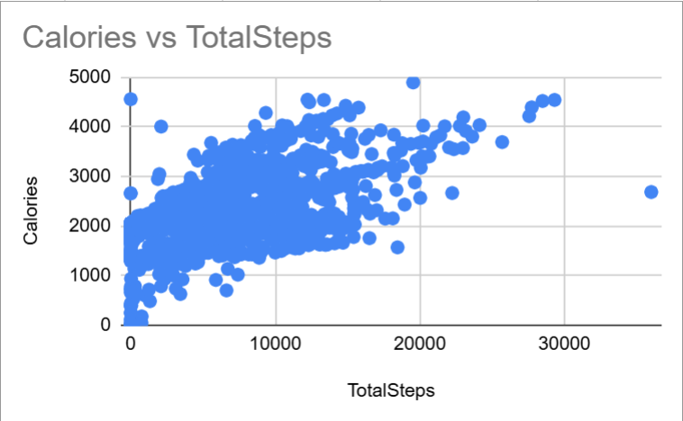
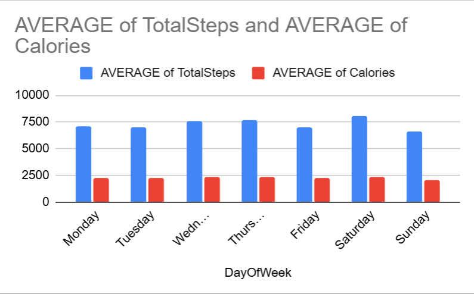
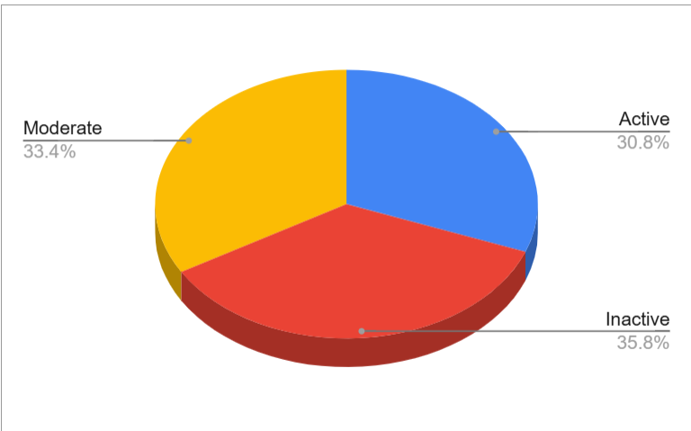
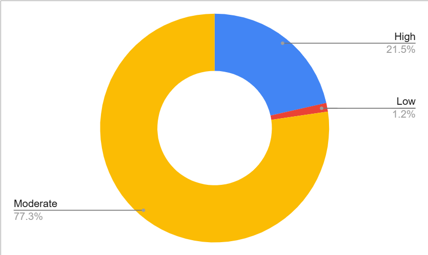

# Bellabeat Case Study: Smart Device Usage Analysis

## Project Overview

This project analyzes smart device usage data to identify user behavior patterns and provide data-driven recommendations to improve engagement and retention for Bellabeat. The analysis focuses on activity levels, usage consistency, and behavioral trends among users.

---

## Business Objective

The objective of this analysis is to evaluate how users interact with fitness tracking devices and identify opportunities to improve user engagement, consistency, and long-term retention.

---

## Key Insights

* **~70% of users are not highly active**
* **77% of users demonstrate moderate consistency**
* **Only 21% of users are highly consistent (45+ days threshold)**
* **User engagement exists but lacks consistency required for sustained behavior**
* **Activity peaks on Saturday (~8,095 steps) and drops on Sunday (~6,586 steps)**

---

## Visual Overview

### Executive Summary

<!-- Replace with your executive summary slide image -->

---

### Steps vs Calories Relationship

<!-- Replace with your scatter plot image -->

**Insight:**
A **positive but moderate relationship** is observed between steps and calories burned. The dispersion of data points indicates that **steps alone do not fully explain calorie burn**, and other factors such as activity intensity influence the outcome.

---

### Activity Trends by Day

<!-- Replace with your bar chart image -->

**Key Observations:**

* **Saturday shows highest activity (~8,095 steps)**
* **Sunday shows lowest activity (~6,586 steps)**
* Indicates a **drop in engagement at the end of the weekend**

---

### User Activity Segmentation

<!-- Replace with your segmentation chart -->

**Distribution:**

* Inactive: ~36%
* Moderately Active: ~33%
* Highly Active: ~31%

**Insight:**
A majority of users (**~70%**) are not highly active, indicating an opportunity to improve overall activity levels.

---

### User Consistency Analysis (Core Finding)

<!-- Replace with your consistency chart -->

**Distribution (45-day threshold):**

* **High Consistency: 21%**
* **Moderate Consistency: 77%**
* **Low Consistency: 1%**

**Key Insight:**
Users are **active but not consistent**, and the **77% moderate segment represents the largest opportunity** for improving long-term engagement.

---

## Dataset

* Source: Fitbit Fitness Tracker Dataset (Kaggle)

### Limitations

* Dataset is not specific to Bellabeat users
* Limited sample size
* Short observation period

---

## Data Preparation

The dataset was cleaned and transformed using Google Sheets:

* Standardized date formats and corrected inconsistencies
* Removed duplicate records
* Created derived variables:

  * Activity Level (Inactive, Moderately Active, Highly Active)
  * Total Active Minutes
  * User Consistency (based on a **45-day threshold**)

---

## Recommendations

* **Convert moderately engaged users into highly consistent users**
* Introduce **streak-based rewards and reminders** to reinforce habits
* Target **low-activity periods (Sundays)** through engagement campaigns
* Provide **personalized insights** to encourage sustained usage

---

## Tools Used

* Google Sheets (data cleaning and analysis)
* Canva (presentation and visualization)

---

## Full Presentation

## Full Presentation

[View Complete Case Study](file:///C:/Users/RAHUL/OneDrive/문서/Data%20Analytics%20Projects/Bellabeat%20Capstone/Bellabeat%20Usage%20Anal)

---

## Conclusion

The analysis indicates that the primary opportunity for Bellabeat lies in **improving user consistency rather than solely increasing activity levels**. By focusing on **habit formation and sustained engagement**, Bellabeat can significantly enhance user retention and long-term product value.
